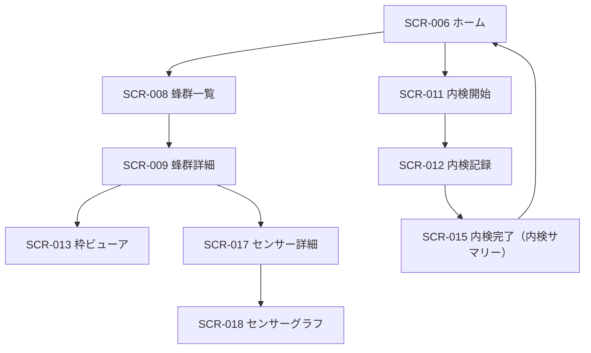
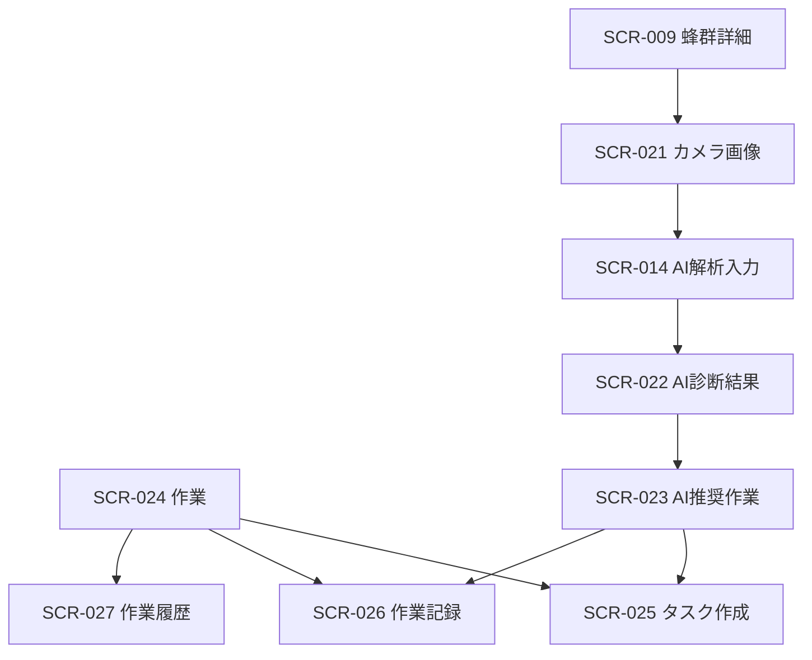

# HoneyOS UI実装仕様

最終更新: 2026-10-04  
対象: モバイルPWA / 日本語を既定言語とする HoneyOS

## 1. 目的と設計原則

この文書は、画面デザインをReact実装に渡すための決定版UI仕様である。画面ごとの判断を減らし、同じ操作・状態・数値がどの画面でも同じ意味で扱われることを目的とする。

### 守る原則

1. **現場では次の行動を最優先にする。** ホームと作業は「見る」より先に「次に何をするか」を示す。
2. **実測値と推定・合成値を混同しない。** 蜂量・育児・貯蜜は実測に近い内訳、蜂群の強さは `簡易指標 β` と明示する。
3. **警告は例外だけに使う。** コーラルは危険・期限超過・保存失敗のみ、アンバーは主操作と注意、緑は完了・適正・良好に限定する。
4. **内検は手袋をしたまま完結する。** 最小タップ領域は44px、入力中はボトムナビを出さず、戻る・次へ・保存を画面下部に固定する。
5. **空状態・エラー・オフラインも画面仕様である。** データがない時に空白や壊れたグラフを出さない。

---

## 2. ナビゲーション確定

### 2.1 メインナビゲーション

ログイン後の通常画面は、次の5タブを固定表示する。

| タブ | 既定画面 | 目的 |
|---|---|---|
| ホーム | SCR-006 | 今日の状態と次の内検・作業を判断する |
| 養蜂場 | SCR-008 | 全蜂群の一覧・検索・比較をする |
| 作業 | SCR-024 | 予定を実行し、記録を残す |
| 分析 | SCR-028 | 月次・長期の経営判断をする |
| 設定 | SCR-031 | アカウント、通知、データを管理する |

アクティブタブのみアンバー。ネストした詳細画面、フォーム、内検フロー、認証画面にはボトムナビを表示しない。

### 2.2 画面台帳（番号・名称の正規化）

この台帳を、画面番号・正式名称・実装状態を判断する唯一の基準とする。詳細仕様、コード内コメント、テスト名、Pull Requestでは必ずこの名称を使用する。

#### 状態の定義

| 状態 | 意味 |
|---|---|
| 有効 | 現行仕様で使用する画面番号 |
| 廃止 | 独立画面を設けない。番号を再利用しない |
| 統合済み | 別番号の機能を統合先画面で提供する。番号を再利用しない |
| 旧版実装 | ルートの`index.html`に実装がある |
| React実装 | `react-ui`に画面コンポーネントとVisual Testがある |
| 移植待ち | 旧版にはあるがReact版には未移植 |
| 遷移未接続 | 画面本体はあるが、実画面からの導線が未接続 |

#### 正式画面台帳

| 番号 | 正式名称 | 状態 | 実装上の扱い |
|---|---|---|---|
| SCR-001 | ログイン | 有効・React実装 | 認証開始画面 |
| SCR-002 | 新規登録 | 有効・React実装 | アカウント作成 |
| SCR-003 | オンボーディング① ようこそ | 有効・React実装 | 初回導入 |
| SCR-004 | オンボーディング② 養蜂場設定 | 有効・React実装 | 初期情報入力 |
| SCR-005 | オンボーディング③ 準備完了 | 有効・React実装 | 初回導入完了 |
| SCR-006 | ダッシュボード | 有効・React実装 | ホームタブ既定画面 |
| SCR-007 | 通知センター | 有効・React実装 | 通知一覧 |
| SCR-008 | 蜂群一覧 | 有効・React実装 | 旧称「蜂群サマリー」は使用しない |
| SCR-009 | 蜂群詳細（巣箱詳細） | 有効・React実装 | 旧SCR-009「養蜂場詳細」は廃止。旧SCR-009bを統合 |
| SCR-010 | 養蜂場マップ | 有効・React実装 | 養蜂場タブの地図表示 |
| SCR-011 | 内検開始 | 有効・React実装 | 蜂群・日付選択 |
| SCR-012 | 内検記録 | 有効・React実装 | 段→枠の入力画面 |
| SCR-013 | 枠ビューア | 有効・React実装 | 段追加等は本画面のサブビューとして扱う |
| SCR-014 | AI解析入力 | 有効・React実装 | 内検・画像データを解析へ渡す |
| SCR-015 | 内検完了（内検サマリー） | 有効・React実装 | 「内検サマリー」「InspectionComplete」をこの名称に統一 |
| SCR-016 / 016b | 内検履歴ダッシュボード / 内検詳細 | 廃止 | SCR-009のポップアップとSCR-013へ統合。番号再利用禁止 |
| SCR-017 | センサー詳細 | 有効・React実装 | センサー種別カード一覧 |
| SCR-018 | センサーグラフ | 有効・React実装・統合先 | 温度・湿度・重量・音響を種別パラメータで切り替える |
| SCR-019 | 旧・湿度グラフ | 統合済み | SCR-018へ統合。番号再利用禁止 |
| SCR-020 | 旧・重量等グラフ | 統合済み | SCR-018へ統合。番号再利用禁止 |
| SCR-021 | カメラ画像 | 有効・React実装 | 画像一覧・撮影・アップロード |
| SCR-022 | AI診断結果 | 有効・React実装 | 診断結果表示 |
| SCR-023 | AI推奨作業 | 有効・React実装・遷移未接続 | SCR-025/026への導線を接続する |
| SCR-024 | 作業 | 有効・React実装・遷移未接続 | 作業タブ既定画面。BottomNavから接続する |
| SCR-025 | タスク作成 | 有効・React実装 | タスク入力 |
| SCR-026 | 作業記録入力 | 有効・React実装 | 新規入力とSCR-027からの編集を兼ねる |
| SCR-027 | 作業履歴 | 有効・React実装・遷移未接続 | 行タップはSCR-026編集モードへ遷移 |
| SCR-028 | レポート | 有効・React実装・遷移未接続 | 分析タブ既定画面。SCR-027と相互接続する |
| SCR-029 | 蜂群トレンド | 有効・React実装 | 時系列分析 |
| SCR-030 | 蜂群比較 | 有効・React実装 | 複数蜂群比較 |
| SCR-031 | 設定 | 有効・旧版実装・移植待ち | `index.html`には実装済み。React版で新規設計せず移植する |
| SCR-032 | 蜂群追加 | 有効・React実装 | 旧表記「蜂群新規追加」は使用しない |
| SCR-033 | 養蜂場追加 | 有効・React実装 | 旧表記「養蜂場新規追加」は使用しない |
| SCR-034 | パスワード再設定 | 有効・React実装 | 旧表記「パスワードリセット」を表示名として使用しない |

#### 番号運用ルール

1. SCR-016、SCR-016b、SCR-019、SCR-020は廃止・統合済みの永久欠番とし、別機能に再利用しない。
2. SCR-009は現行の「蜂群詳細（巣箱詳細）」だけを指す。旧「養蜂場詳細」や旧SCR-009bを現行画面名として残さない。
3. 段追加、フィルター、ボトムシート、確認ダイアログなど、親画面内で完結する表示は新しいSCR番号にしない。識別が必要な場合は`SCR-013/S01`のようなサブビューIDを使用する。
4. 画面の完成判定は、コンポーネントの存在だけでなく、正規ルート、遷移、状態、390×844のVisual Testが揃っていることを条件とする。
5. 旧`index.html`と`react-ui`の実装状況を混同しない。React移行中は台帳に両方の状態を明記する。
6. 新しい画面番号は、既存画面・サブビュー・旧版実装で代替できないことを確認してから採番する。

### 2.3 画面遷移





### 2.4 遷移ルール

| 起点 | 操作 | 遷移先 | 引き継ぐ値 |
|---|---|---|---|
| SCR-006 | FAB「内検を始める」 | SCR-011 | なし |
| SCR-008 | 蜂群カード | SCR-009 | `colonyId` |
| SCR-008 | マップアイコン | SCR-010 | 選択中の養蜂場フィルタ |
| SCR-009 | 推移グラフの点 | 内検詳細ポップアップ | `inspectionId` |
| ポップアップ | 「枠ビューアで見る」 | SCR-013 | `colonyId`, `inspectionId` |
| SCR-011 | 蜂群選択→開始 | SCR-012 | `colonyId`, `inspectionDate`, `weather`, 前回の`countMode` |
| SCR-012 | 保存して確認 | SCR-015 | 保存した`inspectionId` |
| SCR-015 | 次の蜂群を内検 | SCR-011 | 同じ養蜂場、当日日付 |
| SCR-022 | 推奨作業を見る | SCR-023 | `diagnosisId`, `colonyId` |
| SCR-023 | タスクに追加 | SCR-025 | 推奨タイトル・期限・優先度・蜂群 |
| SCR-023 | 作業記録を残す | SCR-026 | 種別・蜂群・推奨メモ |
| SCR-024 | タスクを完了→記録を残す | SCR-026 | タスクの種別・蜂群・期限・メモ |
| SCR-026 | 保存 | 直前画面へ戻る | 完了タスクIDを完了状態へ更新 |

### 2.5 戻る操作

- ネスト画面の左上戻るは、必ず直前の文脈へ戻る。タブの既定画面へ強制的に戻さない。
- 未保存フォーム（SCR-012 / SCR-025 / SCR-026）で戻る場合は、変更がある時だけ確認ダイアログを出す。
- 内検記録の下書きは自動保存する。明示保存前の退出時は「下書きとして保存済み」を短く表示する。

### 2.6 実装層と完成判定

| 実装層 | 現在の役割 | 判定上の注意 |
|---|---|---|
| ルート`index.html` | 現在のGitHub Pages公開対象となる旧版アプリ | SCR-031は実装済みだが、廃止済みSCR-016/016bと旧SCR-009「養蜂場詳細」も残存する |
| `react-ui` | 正式UI仕様に沿って画面単位で整備中のReact版 | SCR-001〜030、032〜034は実装済み。SCR-031は旧版からの移植待ち |

「リポジトリ内にコードがある」「React画面が単独URLで表示できる」「実画面の操作から到達できる」「公開対象へ統合されている」を別々に判定する。Visual Testが直接URLを開いて成功しても、画面遷移の接続完了を意味しない。

### 2.7 既知の遷移・名称修正対象

次の項目は新規画面制作ではなく、既存画面の接続・整理として扱う。

| 起点 | 現状 | 正しい処理 |
|---|---|---|
| BottomNav「作業」 | 空のダッシュボードを表示する場合がある | SCR-024へ遷移する |
| BottomNav「設定」 | React版では空のダッシュボード表示 | React移植後のSCR-031へ遷移する。移植前に新規設計しない |
| SCR-009 内検詳細ポップアップ | SCR-013を「未実装」扱い | `colonyId`と`inspectionId`を渡してSCR-013へ遷移する |
| SCR-009「内検履歴を見る」 | SCR-012を「未実装」扱い | SCR-013の履歴文脈へ遷移する |
| SCR-009 クイック導線 | SCR-021・027・AI画面を「未実装」扱い | 既存画面へ接続する。AI導線は既存結果ならSCR-022、新規解析ならSCR-014を使用する |
| SCR-015「作業記録を追加」 | SCR-026を「未実装」扱い | SCR-026へ遷移する |
| SCR-015「AI解析」 | SCR-014を「未実装」扱い | SCR-014へ遷移する |
| SCR-023 推奨作業 | SCR-025/026を「未実装」扱い | 推奨内容を引き継いでSCR-025/026へ遷移する |
| SCR-027 履歴行 | 独立した未実装詳細を開こうとする | SCR-026を編集モードで開く |
| SCR-027「詳しく分析する」 | SCR-028を「未実装」扱い | SCR-028へ遷移する |
| 旧`index.html` | 旧SCR-009、SCR-016/016bが現行画面として残る | 現行ルートから除外し、台帳上の統合先へ接続する |

タブ遷移は`activeTab`の変更だけで済ませず、タブごとの既定画面へルートも同時に切り替える共通ハンドラーに集約する。

---

## 3. 共通コンポーネント

### 3.1 アプリ共通

| コンポーネント | 用途 | 必須仕様 |
|---|---|---|
| `AppHeader` | タイトル・戻る・通知・検索・操作 | 高さ56px。ネスト画面は戻る、タブ画面はタイトル。未送信データがある時だけ同期インジケーターを表示。 |
| `BottomNav` | 5タブの移動 | 高さ72px（安全領域を除く）。タップ領域44px以上。内検・フォーム・認証では非表示。 |
| `PrimaryButton` | 主操作 | アンバー背景、白文字、高さ52px。ローディング中はラベルを保持しスピナーを併記。 |
| `SecondaryButton` | 補助操作 | 白背景＋境界線。破壊操作には使わない。 |
| `FloatingActionButton` | 頻繁な作成・開始 | 56px円形または拡張ピル。画面右下、ボトムナビの上に固定。1画面1個まで。 |
| `StatusBadge` | 良好・注意・危険・期限 | 色だけに依存せず、アイコンと文言を必ず併記。 |
| `FilterChip` | 絞り込み | 複数選択可。選択中は淡いアンバー背景＋アンバー文字。 |
| `SegmentedControl` | 互いに排他的な表示切替 | 2〜4択まで。選択状態は塗り、非選択は白〜薄灰。 |
| `EmptyState` | データなし | 理由、次の行動、主ボタンを必ずセットで表示。 |
| `ErrorBanner` | エラー通知 | 画面上部に固定。自動で消さず、閉じる操作を提供。 |
| `OfflineIndicator` | 未送信・オフライン | 小さい同期アイコン＋件数。通常時は完全に非表示。 |

### 3.2 蜂群・内検共通

| コンポーネント | 用途 | 必須仕様 |
|---|---|---|
| `ColonyCard` | SCR-008 / SCR-011の蜂群表示 | 蜂群名、状態、全枠平均の構成比、前回比、最終内検日。構成比は実測値で、強さスコアと混同しない。 |
| `CompositionBar` | 蜂・育児・貯蜜・空間 | 蜂=チャコール、育児=コーラル、貯蜜=アンバー、空間=薄灰。全枠平均は積み上げ表示可。枠入力の個別値は重複するため独立バーを使う。 |
| `StrengthChart` | 蜂群の強さ | `簡易指標 β` と表示。0〜100、注意ライン60、算出方法への導線を常にセットにする。 |
| `FrameBar` | SCR-012 / SCR-013の枠 | 枠番号、蜂・育児・貯蜜・空き、選択状態、AI警告重ね表示を持つ。 |
| `QueenStatus` | 女王状態 | `産卵中`（緑）、`未確認`（灰）、`不安`（コーラル）。王冠アイコン＋文言。 |
| `SensorCard` | センサー種別一覧 | 現在値、単位、状態、ミニスパークライン、最終更新、遷移矢印。 |

### 3.3 作業・分析共通

| コンポーネント | 用途 | 必須仕様 |
|---|---|---|
| `TaskRow` | 作業一覧・通知 | チェック、種別アイコン、タイトル、蜂群チップ、期限バッジ、矢印。チェックは即時完了。 |
| `ColonyChip` | 蜂群との紐づけ | タップでSCR-009へ。複数時は最大2件＋`+N`表記。 |
| `MetricCard` | レポートKPI | 指標名、値、単位、前期比。最大4枚を2×2で配置。 |
| `LineChart` | 推移グラフ | 凡例、単位、期間、データ不足の説明を必須化。 |
| `DataTable` | 蜂群比較 | 先頭列を固定。横スクロール可。現在のソート列を明示。 |

---

## 4. デザイントークン

### 4.1 カラー

```css
:root {
  --color-bg: #F8F7F4;
  --color-surface: #FFFFFF;
  --color-surface-subtle: #F3F4F6;
  --color-border: #E3E5E8;
  --color-text: #17212B;
  --color-text-secondary: #66707A;
  --color-text-tertiary: #9AA2AA;

  --color-primary: #E39A16;
  --color-primary-strong: #C97C00;
  --color-primary-soft: #FFF3D8;
  --color-link: #1769C2;

  --color-success: #218446;
  --color-success-soft: #E8F6EC;
  --color-warning: #BD7A00;
  --color-warning-soft: #FFF3D8;
  --color-danger: #D94848;
  --color-danger-soft: #FFF0F0;
  --color-info: #2778C4;
  --color-info-soft: #EAF4FF;

  --color-bees: #3B4650;
  --color-brood: #E86C64;
  --color-honey: #EAAE29;
  --color-space: #D9DEE3;
  --color-foundation: #C5CDD4;
}
```

### 4.2 余白・角丸・影

| トークン | 値 | 用途 |
|---|---:|---|
| `--space-1` | 4px | アイコンと短い文言の間 |
| `--space-2` | 8px | 行内要素・最小ギャップ |
| `--space-3` | 12px | カード内の標準余白 |
| `--space-4` | 16px | 画面左右余白・カード間 |
| `--space-5` | 24px | セクション間 |
| `--space-6` | 32px | 大きな画面区切り |
| `--radius-sm` | 8px | チップ・小ボタン |
| `--radius-md` | 12px | 入力欄・行カード |
| `--radius-lg` | 16px | 大きなカード・ボトムシート |
| `--shadow-float` | `0 8px 24px rgba(23,33,43,.12)` | FAB・ボトムシートのみ |

画面の水平余白は16px。通常カードの内側余白は16px。カードを連続表示するリストでは区切り線を優先し、カードを多用しない。

### 4.3 文字・アイコン

| 用途 | サイズ / 行高 | 太さ |
|---|---|---:|
| 画面タイトル | 22px / 30px | 700 |
| セクションタイトル | 18px / 26px | 700 |
| KPI大値 | 32px / 38px | 700 |
| リスト主文 | 16px / 24px | 600 |
| 本文・入力値 | 15px / 22px | 400〜500 |
| 補助文・日時 | 13px / 18px | 400〜500 |
| バッジ・軸ラベル | 12px / 16px | 600 |

アイコンは原則24px、行内の補助アイコンは20px。アイコンのみのボタンも44×44px以上にする。

### 4.4 モーションと操作

- 画面遷移: 180〜220ms、標準の横スライドまたはフェード。
- タップ: 80ms以内に押下状態を返す。
- 数値・グラフの更新: 150ms程度の短いクロスフェード。派手なアニメーションは使わない。
- 破壊的操作: 即時アニメーションで消さず、アーカイブ完了トースト＋元に戻す導線を出す。

---

## 5. データ表示ルール

### 5.1 蜂群の強さ

`蜂群の強さ`は暫定の合成指標であり、常に`簡易指標 β`のラベルを添える。

```text
蜂量 40% + 育児量 30% + 貯蜜量 20% + 女王状態 10%
```

- 60未満を注意ラインとする。
- 女王未確認、高温、AI異常などは、スコアが60以上でも個別の注意状態を付与できる。
- 季節補正がない期間は、比較画面と詳細画面に`季節補正なし`を表示する。

### 5.2 枠データ

- 蜂の被覆率と育児・貯蜜の面積割合は同時に存在し得る。個別枠の編集・プレビューでは、3つを合計100%に制約しない。
- 全枠平均の一覧用サマリーだけは、認知負荷を下げるため構成比バーで表現してよい。
- 空きは`巣礎`と`空巣房`を区別して保存し、ビューアで識別可能にする。

---

## 6. 状態設計

### 6.1 全画面共通状態

| 状態 | 表示 | 操作 |
|---|---|---|
| 初期ロード | コンテンツ形状に沿ったスケルトン | 既存のナビ操作は可。主要操作はデータ確定まで無効。 |
| 更新中 | 値を保持したまま小さなインジケーター | 画面全体を覆うローディングは使わない。 |
| 空 | 理由＋主導線 | 空白だけを表示しない。 |
| 軽微エラー | 上部エラーバナー | 再試行を提供。既存キャッシュがあれば表示継続。 |
| 致命的エラー | エラー状態カード＋再試行 | 保存・実行は不可。エラー詳細は隠しすぎない。 |
| オフライン | ヘッダーの同期インジケーター | 読み取りはキャッシュ、書き込みはキュー。件数を確認可能。 |
| 権限未許可 | 説明＋設定へ導線 | 位置情報・通知・カメラなど、必要な場面だけで要求する。 |

### 6.2 画面別の空・読込・エラー・オフライン

| 画面 | 空状態 | 読込 | エラー / オフライン |
|---|---|---|---|
| SCR-006 ホーム | 「蜂群を登録すると状態が表示されます」＋蜂群追加 | 警告・気象・KPIのスケルトン | 気象だけ失敗時は「天気を取得できません」。蜂群データはキャッシュ表示。 |
| SCR-007 通知 | 「新しい通知はありません」 | 通知行スケルトン | オフラインではキャッシュ通知を表示し「更新待ち」。 |
| SCR-008 蜂群一覧 | 「蜂群がまだありません」＋蜂群追加 | 6枚のカードスケルトン | 一覧取得失敗は再試行。オフラインは最終同期時刻を表示。 |
| SCR-009 蜂群詳細 | 「内検記録がありません」＋内検開始 | グラフ・センサー・履歴を個別スケルトン | 一部取得失敗は該当セクションだけエラー。 |
| SCR-010 マップ | 「養蜂場を登録すると地図に表示されます」 | 地図領域のプレースホルダー | 位置情報拒否は現在地なしで表示。地図失敗時は養蜂場リストへ導く。 |
| SCR-011 内検開始 | 「条件に合う蜂群がありません」＋フィルタ解除 | 蜂群カードスケルトン | オフラインでもキャッシュ蜂群で開始可。天気は後で再取得。 |
| SCR-012 内検記録 | 初回は空枠＋「枠を追加」 | 前回記録をスケルトンでプリセット | 保存失敗は致命的バナー＋ローカル下書きを保持・再送。 |
| SCR-013 枠ビューア | 「この日の枠記録はありません」＋編集 | 段・枠バーのスケルトン | 編集保存はキュー可能。過去日が未取得なら日付切替を無効化。 |
| SCR-014 AI解析入力 | 画像なしは正常状態。「画像なしで解析」を許可 | 連携内検データのスケルトン | 内検データ未取得なら開始不可。画像アップロード失敗は個別再試行。 |
| SCR-015 内検完了（内検サマリー） | 該当なし（保存直後のみ） | 保存確定中はボタンを無効化 | 保存未確定時は完了画面へ進ませず、下書きと再試行を出す。 |
| SCR-017 センサー詳細 | 「センサー未設置」＋設置方法 | カードスケルトン | 未接続は灰カード、API失敗は前回値＋取得失敗表示。 |
| SCR-018 センサーグラフ | 「この期間のデータはありません」 | グラフ枠スケルトン | 欠損区間は線をつながず、欠損として表示。 |
| SCR-021 カメラ画像 | 「まだ画像がありません」＋撮影/アップロード | サムネイルスケルトン | アップロード失敗は該当サムネイルに再送ボタン。 |
| SCR-022 AI診断結果 | 「診断結果はありません」＋AI解析へ | 診断カードスケルトン | 解析失敗は原因・再解析・内検へ戻る導線。 |
| SCR-023 推奨作業 | 「推奨作業はありません」＋診断結果へ戻る | 推奨カードスケルトン | 推奨取得失敗時も診断結果は読める状態を保つ。 |
| SCR-024 作業 | 「タスクはありません」＋タスク作成 | カレンダーまたは行のスケルトン | オフライン完了操作は即時反映し同期キューへ。 |
| SCR-025 タスク作成 | 該当なし | フィールド初期値スケルトン不要 | 保存失敗は入力値を保持。期限・タイトルのバリデーションを行内表示。 |
| SCR-026 作業記録 | 該当なし | 引継ぎ値だけ小スケルトン | 保存失敗は下書き化し、再送ボタン。 |
| SCR-027 作業履歴 | 「作業記録がまだありません」＋作業記録追加 | 行スケルトン | フィルタ結果0件は「該当する記録がありません」。 |
| SCR-028 レポート | 「記録がたまるとレポートを表示できます」 | KPI・グラフのスケルトン | 指標ごとの欠損は`—`と理由。 |
| SCR-029 トレンド | 「内検データが2回分たまると表示されます」＋内検開始 | グラフスケルトン | 比較群の一部欠損は凡例で`データ不足`を表示。 |
| SCR-030 比較 | 「比較できる蜂群がありません」＋蜂群追加 | 表スケルトン | 最新記録がない群は`未内検`行として残す。 |
| SCR-031 設定 | 該当なし | プロフィール・設定行スケルトン | 同期状況の失敗は再試行。破壊操作は実行前に確認。 |
| SCR-032/033 | 該当なし | セレクタだけスケルトン | 保存失敗は値を保持。養蜂場0件時はSCR-033へ誘導。 |
| SCR-001/002/034 | 該当なし | 送信中ボタン状態 | 認証エラーは一般化した文言で表示。メール送信済みは成功状態を明示。 |

---

## 7. 実装順序

### Phase 1: アプリ骨格

1. `AppHeader`、`BottomNav`、ボタン、入力、バナー、スケルトン、空状態を実装する。
2. デザイントークンをCSS変数として適用する。
3. 画面ルーティングと戻る操作、オフラインキューの表示だけを先に接続する。

### Phase 2: 日常運用

1. SCR-006、SCR-008、SCR-009、SCR-011〜015。
2. SCR-024〜027。
3. これらが、蜂群管理・内検・作業記録の最小実用単位となる。

### Phase 3: 深掘り

1. SCR-013、SCR-017〜018、SCR-021。
2. SCR-028〜030。
3. SCR-014、SCR-022〜023のAI連携。

### 受け入れ条件

- 画面ごとに、通常・空・読込・エラー・オフラインを確認できる。
- 主要操作は片手で到達でき、タップ領域44px以上を満たす。
- 合成指標には`簡易指標 β`と算出方法導線がある。
- 内検の保存失敗で入力データが失われない。
- 蜂群・作業・AI推奨の引き継ぎ値が手入力なしでフォームに入る。
